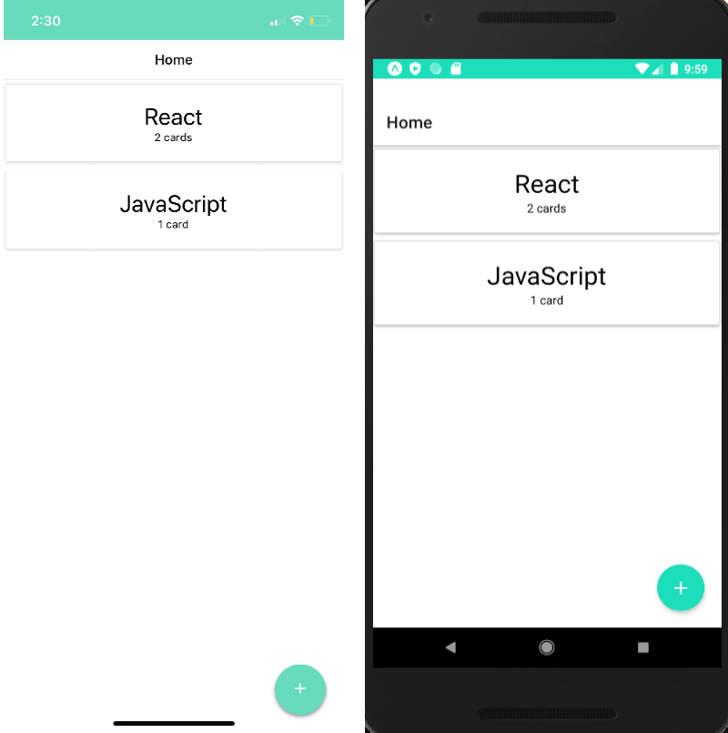
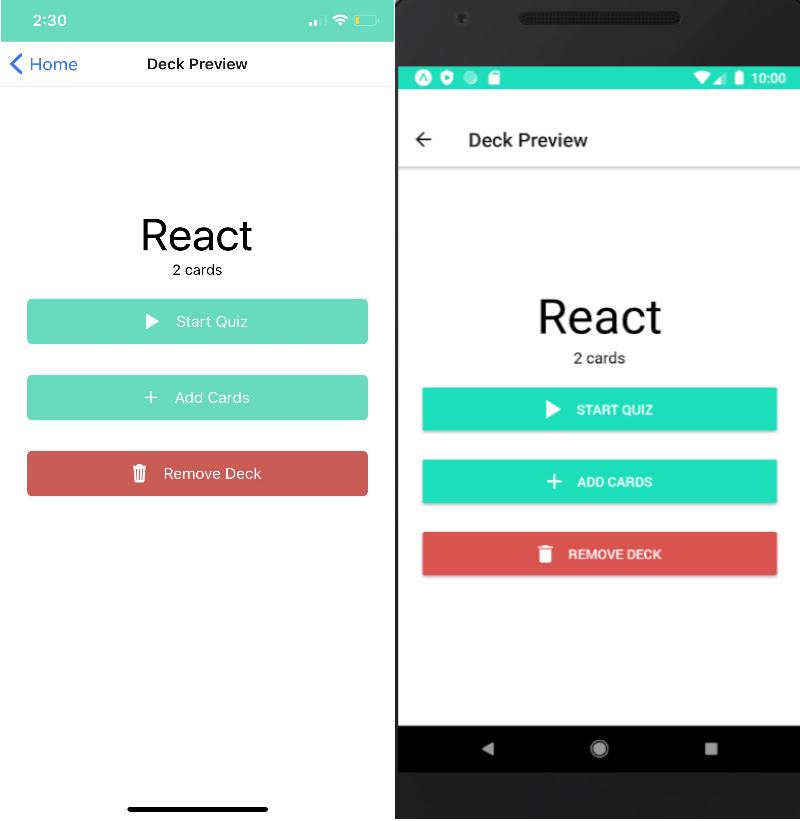
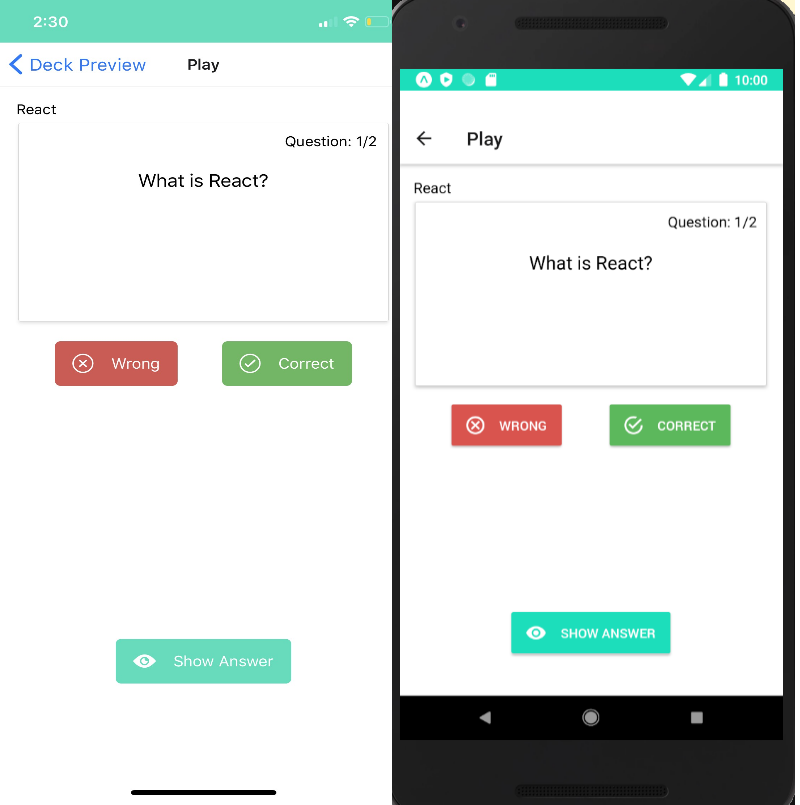

# Mobile Flashcards Project

This is a project form Udacity's React Nanodegree called Mobile Flashcards.
The project is to help the developer practice the skills of React Native in combination with it's native API's and Redux.

## Dependencies of the Project. 
The project has the following extensions from npm.
  1. Redux Store
  2. Nativebase
  3. React Navigation
  4. Redux Thunk

## Instructions
Project has been tested on both iOS (iPhone X) and Android.
Preferrably test in iOS using expo.

Run `expo start` on the terminal and scan the QR code.

Run `expo start --android` for Android.

Run `expo start --ios` for iOS.

## Screenshots
Screenshots where taken from iPhone X (iOS) and Android Emulator Nexus 5X (Android)

HomePage iOS (Left) Android (Right)

DeckView iOS (Left) Android (Right)

CardView iOS (Left) Android (Right)

